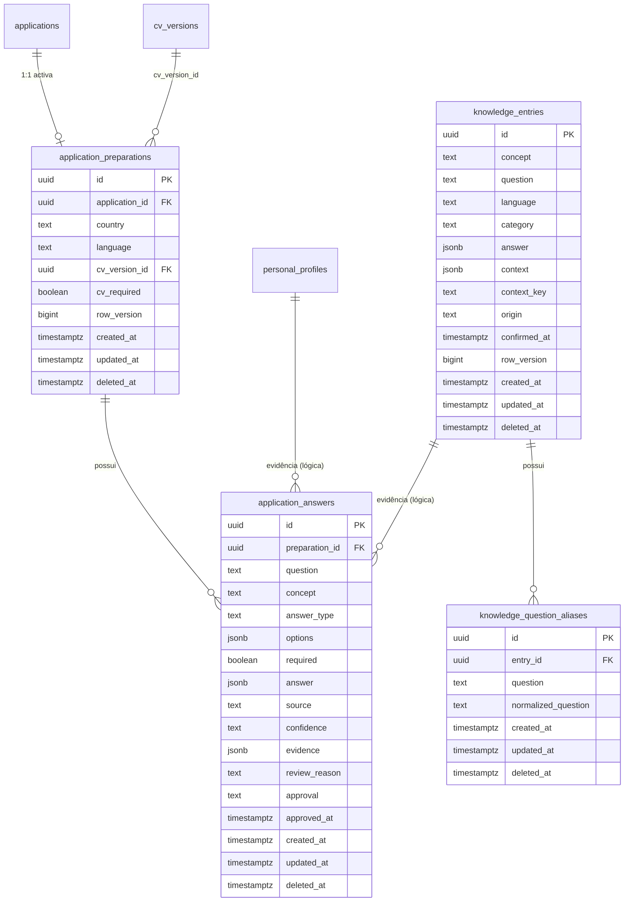
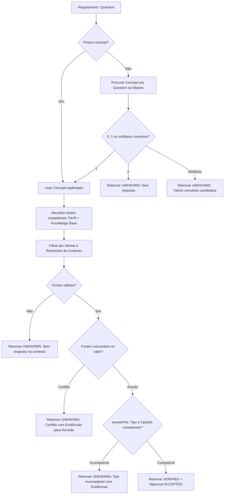

# Arquitetura — Application Agent & Preparation

**Data:** 2026-10-05  
**Componente:** `server/application-answer-resolver.ts`, `server/postgres-store.ts`, `server/db/migrations/006_application_agent.sql`, `dashboard/src/domain/applicationPreparation.ts`, `dashboard/src/domain/knowledge.ts`  
**Estado:** Implementado (MVP: Knowledge Base + Application Preparation)

---

## 1. Visão Geral e Propósito

O **Application Agent** introduz no CareerAssistant uma entidade persistida de preparação de candidaturas (`application_preparations`), dissociando a decisão de dados da execução no navegador:

1. **Candidate Knowledge Base (`knowledge_entries`, `knowledge_question_aliases`)**: Base de conhecimento estruturada para respostas reutilizáveis do candidato com escopo contextual (global, país, localização, tipo de contrato, empresa, vaga ou candidatura), tipagem rigorosa e controlo de aliases.
2. **Personal Profile Integration**: Resolução determinística a partir do perfil pessoal (`personal_profiles`) para dados de contacto e autorizações de trabalho/sponsorship por país.
3. **Application Preparation (`application_preparations`, `application_answers`)**: Snapshot imutável associado a uma candidatura e a uma versão concreta de CV (`cv_version_id`), contendo requisitos/perguntas, propostas de resposta com proveniência e estados de aprovação.
4. **Resolution Engine (`resolveAnswer`)**: Motor determinístico sem alucinações. Respostas ambíguas, conflitantes ou com tipos incompatíveis são retidas com evidências para revisão humana explícita.
5. **Human-in-the-Loop & Completeness**: O utilizador aprova, rejeita ou digita respostas. Respostas aprovadas podem ser memorizadas na Knowledge Base com escopo restrito. A prontidão (`READY`) exige 100% dos requisitos obrigatórios aceites, CV fixado e confirmação de inspeção do formulário (`formInspected`).

---

## 2. Modelo de Dados e Esquema Relacional

A persistência foi desenhada no PostgreSQL através da migração `006_application_agent.sql`.

### Entidades Detalhadas

### 2.1 `knowledge_entries`
- **Chave Primária:** UUID (`gen_random_uuid()`).
- **Conceito:** Notação canónica `^[a-z0-9_]+(\.[a-z0-9_]+)*$` (ex.: `work_authorization.requires_sponsorship`, `experience.symfony`).
- **Tipos de Resposta (`answer`):** `text`, `boolean`, `number`, `single_select`, `multi_select`, `money` (com precisão exata decimal `NUMERIC(19,4)` em string).
- **Contexto & `context_key`:** Restrições JSONB normalizadas (`COUNTRY`, `LOCATION`, `CONTRACT_TYPE`, `COMPANY`, `JOB`, `APPLICATION`). O `context_key` é a forma canónica ordenada (`TIPO=VALOR` em ordem alfabética), garantindo que restrições equivalentes colidem no índice único independentemente da ordem.
- **Índice Único Ativo:** `CREATE UNIQUE INDEX knowledge_entries_active ON knowledge_entries(concept, language, context_key) WHERE deleted_at IS NULL;`

### 2.2 `knowledge_question_aliases`
- Variações e formulações equivalentes da pergunta principal associadas a uma entrada de conhecimento.
- `normalized_question`: Texto normalizado via `NFKD`, sem acentos, pontuação ou maiúsculas (`normalizeText`).
- **Índice Único Ativo:** `CREATE UNIQUE INDEX knowledge_question_aliases_active ON knowledge_question_aliases(entry_id, normalized_question) WHERE deleted_at IS NULL;`

### 2.3 `application_preparations`
- Agregado raiz da preparação de uma candidatura específica (`application_id`).
- Fixa o contexto de resolução (`country`, `language`), exigência de CV (`cv_required`) e a versão exata do CV (`cv_version_id`).
- **Índice Único Ativo:** `CREATE UNIQUE INDEX application_preparations_active ON application_preparations(application_id) WHERE deleted_at IS NULL;`
- **Controlo de Concorrência:** `row_version BIGINT NOT NULL DEFAULT 1`.

### 2.4 `application_answers`
- Snapshots independentes de cada requisito/pergunta para a preparação.
- Guarda o valor tipado, opções (`options`), obrigatoriedade (`required`), origem (`source`: `PROFILE`, `KNOWLEDGE_BASE`, `CV`, `USER`, etc.), nível de confiança (`confidence`), objeto de evidências (`evidence`) com fontes e revisões, motivo de revisão (`review_reason`), estado de aprovação (`approval`: `pending`, `accepted`, `rejected`) e `approved_at`.
- **Integridade:** `CHECK (approval <> 'accepted' OR (answer IS NOT NULL AND approved_at IS NOT NULL))` impede que respostas sem valor ou sem timestamp fiquem em estado aceite.

---

## 3. Conformidade com as Regras de Domínio

| Regra do Projeto | Implementação na Migração 006 / Store | Avaliação |
|---|---|---|
| **UUIDs** | Todas as tabelas usam `id UUID PRIMARY KEY DEFAULT gen_random_uuid()`. Chaves estrangeiras usam UUIDs tipados e restritos. | **Conforme** |
| **Soft Delete** | Todas as 4 tabelas possuem `created_at`, `updated_at`, `deleted_at TIMESTAMPTZ`. Índices únicos usam `WHERE deleted_at IS NULL`. | **Conforme** |
| **Row Versioning** | As entidades principais (`knowledge_entries`, `application_preparations`) têm `row_version BIGINT NOT NULL DEFAULT 1`. Entidades filhas (`application_answers`, `knowledge_question_aliases`) delegam a concorrência ao agregado raiz via `revisedPreparation` / `writeKnowledge`, que incrementam a versão do pai. | **Conforme** |
| **Triggers (`zz_touch`)** | Trigger `zz_touch` instalado em todas as 4 tabelas. Atualiza `updated_at := clock_timestamp()` e incrementa `row_version` atomicamente quando presente. | **Conforme** |
| **Triggers (`require_active_parent`)** | Instalado em `knowledge_question_aliases` (exige `knowledge_entries` ativa), `application_preparations` (exige `applications` ativa e `cv_versions` ativa), e `application_answers` (exige `application_preparations` ativa). | **Conforme** |
| **Triggers (`protect_shared_delete`)** | Função `protect_shared_delete()` estendida para proteger versões de CV referenciadas em `application_preparations`, impedindo a sua eliminação com erro `23514`. | **Conforme** |
| **Transações e Atomicidade** | Todas as operações de mutação na `PostgresStore` (`saveKnowledge`, `startPreparation`, `updatePreparation`, `selectPreparationCv`, `addPreparationAnswer`, `savePreparationAnswer`, `resolvePreparation`) correm dentro de blocos `transaction()`. | **Conforme** |

---

## 4. Motor de Resolução (`resolveAnswer`)

O motor de resolução em `server/application-answer-resolver.ts` opera de forma estritamente determinística:

### Regras Centrais de Negócio:
1. **Sem Inferência de Residência:** A residência ou nacionalidade no perfil não autoriza trabalho nem sponsorship. Exige-se correspondência explícita em `workAuthorizations` para o país da vaga (`context.country`). Países omissos ou estados `unknown` permanecem estritamente `null` / `UNKNOWN`.
2. **Qualificadores de Aliases:** Perguntas com qualificadores temporais distintos (ex.: sponsorship atual vs futuro) possuem conceitos canónicos separados. Aliases só coincidem após normalização de texto exata; perguntas genéricas não unificam conceitos qualificados.
3. **Imutabilidade e Snapshots:** As respostas na preparação são snapshots. Alterações posteriores no perfil pessoal ou na Knowledge Base nunca reescrevem respostas já revistas ou aprovadas numa candidatura.
4. **Invalidation por Mudança de Contexto:** Se o país ou idioma da preparação for alterado (`updatePreparation`), respostas automáticas originárias de `PROFILE` ou `KNOWLEDGE_BASE` retornam ao estado `pending` com motivo explícito, preservando as respostas manuais do utilizador (`USER`).
5. **Memorização de Resposta (`Remember this answer`):**
   - O utilizador pode memorizar uma resposta aceite para uso futuro.
   - Requer aprovação explícita e indicação de conceito e escopo (`scopes`).
   - Respostas sem escopo específico para a candidatura não vazam para escopo global.
   - Falhas na criação da entrada de conhecimento revertem a gravação da resposta atomicamente.

---

## 5. Resumo de Completude e Estados da Preparação

A função `preparationSummary` calcula o estado do pacote de candidatura:

$$\text{Completude} = \left\lfloor \frac{\text{Requisitos Obrigatórios Aceites} + (\text{CV presente se exigido})}{\text{Total de Requisitos Obrigatórios} + (\text{CV se exigido})} \times 100 \right\rfloor$$

### Estados do Ciclo de Vida:
- **`NOT_READY`**: Se não existirem requisitos configurados, se faltar o CV (quando exigido), ou se algum requisito obrigatório estiver ausente ou com aprovação `rejected`.
- **`NEEDS_REVIEW`**: Todos os requisitos obrigatórios possuem resposta, mas existem itens pendentes de aprovação, OU a completude atingiu 100% mas o formulário externo ainda não foi inspecionado (`formInspected === false`).
- **`READY`**: 100% dos requisitos obrigatórios aceites, CV fixado (quando exigido) e `formInspected === true`.
- **`SUBMITTING` / `SUBMITTED` / `FAILED`**: Reservados para a execução do browser agent em fases subsequentes.

---

## 6. Endpoints da API

| Método | Rota | Descrição | Concorrência |
|---|---|---|---|
| `GET` | `/api/knowledge` | Lista entradas ativas e respetivos aliases | Leitura |
| `POST` | `/api/knowledge` | Cria nova entrada de conhecimento | Unique index (409) |
| `PUT` | `/api/knowledge/:id` | Atualiza entrada de conhecimento existente | `revision` no body (409) |
| `DELETE` | `/api/knowledge/:id` | Soft delete de entrada de conhecimento | `revision` no body (409) |
| `GET` | `/api/applications/:slug/preparations` | Obtém a preparação ativa da candidatura | Leitura (`REPEATABLE READ`) |
| `POST` | `/api/applications/:slug/preparations` | Inicia ou recupera preparação (idempotente) | Lock da candidatura |
| `PUT` | `/api/preparations/:id` | Atualiza país, idioma e obrigatoriedade de CV | `revision` no body (409) |
| `POST` | `/api/preparations/:id/select-cv` | Fixa versão do CV na preparação | `revision` no body (409) |
| `POST` | `/api/preparations/:id/answers` | Adiciona nova pergunta/requisito | `revision` da preparação (409) |
| `PUT` | `/api/preparations/:id/answers/:answerId` | Grava valor, aprovação e memorização opcional | `revision` da preparação (409) |
| `DELETE` | `/api/preparations/:id/answers/:answerId` | Soft delete de pergunta | `revision` da preparação (409) |
| `POST` | `/api/preparations/:id/resolve` | Executa motor de resolução sobre itens pendentes | `revision` da preparação (409) |

---

## 7. Estratégia de Testes e Garantia de Qualidade (QA)

A cobertura atual é dividida em testes unitários puros (`node:test`) e testes de integração com base de dados real PostgreSQL:

### Testes Implementados:
- **`server/application-agent.test.ts` (7 suites unitárias):**
  - Validação de tipos do Zod (`knowledgeFieldsSchema`, `answerValueSchema`, `addAnswerSchema`, `saveAnswerSchema`).
  - Normalização canónica de `contextKey` e independência de ordem.
  - Resolução a partir do `PersonalProfile` e verificação de não-inferência de autorização.
  - Resolução a partir da `KnowledgeBase` com compatibilidade de idioma e restrições de contexto.
  - Aliases, desambiguação e prevenção de fusão indevida de qualificadores.
  - Gestão de conflitos entre fontes e verificação de compatibilidade de opções (`answerFits`).
  - Cálculo de completude e regras de bloqueio de estado `READY` sem inspeção do formulário.
- **`server/postgres.test.ts` (suite de integração):**
  - Execução e verificação da migração `006_application_agent.sql`.
  - Concorrência optimista em gravações simultâneas de knowledge e preparation (`HTTP 409`).
  - Proteção de integridade referencial com trigger `protect_shared_delete` sobre versões de CV.
  - Snapshots imutáveis: mutações posteriores nas fontes não afetam candidaturas preparadas.
  - Transacionalidade na memorização de respostas (`remember`).
  - Invalidação de aprovações automáticas após alteração de país/idioma.
  - Ciclo de vida completo: soft delete da candidatura oculta a preparação; restauro recupera o snapshot; purga definitiva da reciclagem limpa registos órfãos em cascata.

---

## 8. Gaps conhecidos

Durante a análise de QA e verificação de testes, foram identificadas as seguintes lacunas e limitações conhecidas no estado atual:

- **`formInspected` sempre `false`:** O campo `formInspected` na resposta da preparação é retornado fixo como `false` no backend (`postgres-store.ts`), impedindo que qualquer preparação atinja o estado `READY` no MVP (permanecendo no máximo em `NEEDS_REVIEW` quando todos os requisitos estão aceites). A resolução deste gap depende da introdução do agente de navegador (Playwright) em fases posteriores para inspeção real dos formulários externos.
- **Exportação Markdown não inclui knowledge/preparations:** O script e comandos de exportação do sistema (`scripts/export.ts`) exportam candidaturas, vagas, empresas, contactos, notas e documentos, mas ainda não incluem o dump/exportação das tabelas `knowledge_entries`, `knowledge_question_aliases`, `application_preparations` ou `application_answers`.
- **Testes unitários em falta:**
  - `multi_select`: Falta cobertura de testes unitários para respostas do tipo seleção múltipla e validação de subconjunto de opções em `answerFits`.
  - `work_authorization`: Apenas `work_authorization.requires_sponsorship` é testado em `application-agent.test.ts`; `work_authorization.authorized` (distinção entre `authorized` e `not_authorized`) e conceitos escalares de perfil (como `experience.years_total` e contactos) não estão cobertos no resolver unitário.
  - `JOB` e `APPLICATION` scopes: Não há testes unitários isolados no resolver para entradas de conhecimento limitadas estritamente aos escopos de vaga (`JOB`) e candidatura (`APPLICATION`).
- **Testes de integração em falta:**
  - `money`, `number`, `multi_select` roundtrip PostgreSQL: Os testes de integração em `postgres.test.ts` persistem e resolvem apenas tipos `boolean` e `text`. Os tipos numéricos, monetários e seleções estruturadas carecem de verificação de ciclo de vida completo de gravação e leitura na base de dados relacional.

---

## 9. Próximos Passos e Extensões Futuras

1. **Deteção e Inspeção Assistida:** Introdução do Playwright para navegação e deteção de formulários externos, marcando `formInspected = true` após validação da cobertura de campos.
2. **Autofill & Open in Browser:** Preenchimento visual dos campos aprovados e upload do ficheiro do CV fixado, entregando o controlo ao utilizador para submissão manual.
3. **Confirm & Submit:** Modo de submissão automática idempotente com recolha de evidência (screenshot ou confirmação textual) e transição da candidatura para estado `applied`.

